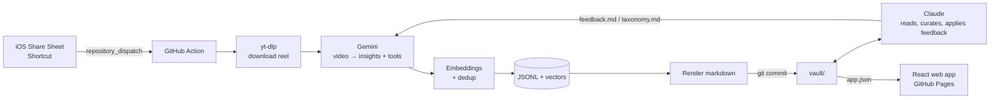

# doomscroll_assistant

Turn the Instagram reels I save while scrolling into a **deduplicated, self-organizing
knowledge base** that an AI assistant (Claude) can read, curate, and learn my preferences from.

Share a reel on iPhone → ~2 minutes later it's filed into [`vault/`](vault/index.md), merged with
everything similar I've saved before, and browsable in the
**[web app](https://samvo.dev/doomscroll_assistant/)** (add it to your Home Screen).



## How it works

1. **Capture.** An iOS Shortcut in the share sheet POSTs the reel URL (and an optional
   "why I saved this" note) to GitHub's `repository_dispatch` API. No server to host.
2. **Extract.** A GitHub Action downloads the video with yt-dlp and sends it to Gemini, which
   watches the frames and audio and returns **structured JSON**: atomic, neutrally-worded
   insights (each tagged principle / pattern / pitfall / tradeoff / …), plus any tools mentioned.
3. **Deduplicate.** Each insight is embedded and compared against the existing vault:

   | Cosine similarity | Action |
   |---|---|
   | ≥ 0.95 | Duplicate: attach the source, bump its count |
   | 0.85–0.95 | Ambiguous: an LLM judge decides *same / nuance / contradicts / different* (batched, one call per reel) |
   | < 0.85 | New: lands in the topic's **Ungrouped** section |

   Repetition becomes signal: an idea five creators agree on shows up as `(×5)` at the top.
4. **Organize.** A weekly job re-clusters each topic (average-linkage agglomerative clustering)
   without churning what's already there: clusters keep the name of the group most of their
   members came from, clusters that match an existing group by meaning fold into it, and only
   genuinely new ones are named by Gemini (told to stay distinct from their neighbours).
   Loners stay Ungrouped, groups Claude edits are pinned, and insights only move when clearly
   closer to a new group. Nuances nest under their parent; contradictions are flagged.
5. **Render.** Markdown and a single `app.json` are generated from the data files, never
   hand-edited, so they can always be rebuilt.
6. **Browse.** A read-only React + TypeScript web app on GitHub Pages loads `app.json`, works
   offline from the Home Screen, and redeploys after every vault change.
   **Ask Claude** buttons on insights, reels, tools, and topics open Claude with a prefilled,
   context-rich prompt (no API key or backend; it runs on the viewer's own Claude plan).
7. **Learn from feedback.** I correct Claude in plain English ("that's not caching"). Claude
   edits the data, and records a rule in [`feedback.md`](vault/feedback.md) and
   [`taxonomy.md`](vault/taxonomy.md). Gemini reads both on every run, so the same mistake
   doesn't happen twice.

## Design decisions

- **GitHub as queue, compute, and database.** `repository_dispatch` is the queue, Actions is the
  compute, and the repo is the storage. It costs nothing and needs no credit card, and every change to
  the knowledge base is a reviewable commit. A `concurrency` group serializes writers.
- **Two models, two jobs.** Gemini (free tier, native video understanding) does per-reel
  extraction. Claude does slower, judgment-heavy curation over the whole vault.
- **Atomic insights, not per-reel notes.** Deduplicating at the level of a single idea is what makes
  topic pages readable instead of an append-only log.
- **No vector database.** A few thousand 768-d vectors fit in one `.npz`; brute-force cosine
  similarity is milliseconds.
- **Pure, testable core.** Dedup and clustering take embeddings and the judge as inputs,
  so they're unit-tested offline without API calls.
- **Workflow hardening.** User-supplied URLs reach the shell only via env vars (no `${{ }}`
  interpolation → no script injection). Secrets live in Actions secrets. Videos are never committed.

## Layout

```
src/doomscroll/
  fetch.py     yt-dlp download + metadata
  gemini.py    video analysis, embeddings, pair judge, group naming (structured output)
  dedup.py     similarity bands → merge / nuance / contradict / new
  regroup.py   stable weekly re-clustering (see module docstring)
  store.py     JSONL + embeddings persistence
  render.py    markdown generation
  export.py    app.json for the web app
  pipeline.py  one URL → updated vault
vault/
  data/        source of truth (insights, tools, reels, embeddings)
  topics/ tools/ reels/ queue.md inbox.md index.md   generated
  app.json                                           generated, read by the web app
  taxonomy.md feedback.md                            human/Claude-edited, read by Gemini
web/           React + TypeScript + Vite app (read-only, offline-capable)
CLAUDE.md      how Claude should read and curate the vault
```

## Setup

```bash
python3 -m venv .venv && source .venv/bin/activate
pip install -e ".[dev]"
pytest

cp .env.example .env        # add GEMINI_API_KEY
set -a; source .env; set +a
python -m doomscroll models  # confirm the model name your key can use
python -m doomscroll process "https://www.instagram.com/reel/..." --note "why I saved it"
```

Web app locally: `cd web && npm install && npm run dev` (it serves `vault/app.json`).

For the automated flow: add `GEMINI_API_KEY` (and optionally `IG_COOKIES`) as repository
secrets, then set up the [iOS Shortcut](shortcut/README.md).
