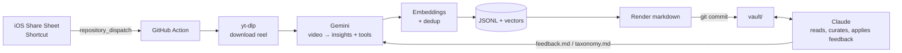

# doomscroll_assistant

Turn the Instagram reels I save while scrolling into a **deduplicated, self-organizing
knowledge base** that an AI assistant (Claude) can read, curate, and learn my preferences from.

Share a reel on iPhone → ~2 minutes later it's filed into [`vault/`](vault/index.md), merged with
everything similar I've saved before.



## How it works

1. **Capture.** An iOS Shortcut in the share sheet POSTs the reel URL (and an optional
   "why I saved this" note) to GitHub's `repository_dispatch` API. No server to host.
2. **Extract.** A GitHub Action downloads the video with yt-dlp and sends it to Gemini, which
   watches the frames and audio and returns **structured JSON**: atomic, neutrally-worded
   insights (each tagged principle / pattern / pitfall / tradeoff / …), plus any tools mentioned.
3. **Deduplicate.** Each insight is embedded and compared against the existing vault:

   | Cosine similarity | Action |
   |---|---|
   | ≥ 0.95 | Duplicate: attach the source, bump its count |
   | 0.85–0.95 | Ambiguous: an LLM judge decides *same / nuance / contradicts / different* (batched, one call per reel) |
   | < 0.85 | New: joins the nearest similar group in its topic |

   Repetition becomes signal: an idea five creators agree on shows up as `(×5)` at the top.
4. **Organize.** A weekly job re-clusters each topic (average-linkage agglomerative clustering)
   and has Gemini name the groups. Nuances nest under their parent; contradictions are flagged.
5. **Render.** Markdown is generated from the data files, never hand-edited, so it can
   always be rebuilt.
6. **Learn from feedback.** I correct Claude in plain English ("that's not caching"). Claude
   edits the data, and records a rule in [`feedback.md`](vault/feedback.md) and
   [`taxonomy.md`](vault/taxonomy.md). Gemini reads both on every run, so the same mistake
   doesn't happen twice.

## Design decisions

- **GitHub as queue, compute, and database.** `repository_dispatch` is the queue, Actions is the
  compute, and the repo is the storage. It costs nothing and needs no credit card, and every change to
  the knowledge base is a reviewable commit. A `concurrency` group serializes writers.
- **Two models, two jobs.** Gemini (free tier, native video understanding) does per-reel
  extraction. Claude does slower, judgment-heavy curation over the whole vault.
- **Atomic insights, not per-reel notes.** Deduplicating at the level of a single idea is what makes
  topic pages readable instead of an append-only log.
- **No vector database.** A few thousand 768-d vectors fit in one `.npz`; brute-force cosine
  similarity is milliseconds.
- **Pure, testable core.** Dedup and clustering take embeddings and the judge as inputs,
  so they're unit-tested offline without API calls.
- **Workflow hardening.** User-supplied URLs reach the shell only via env vars (no `${{ }}`
  interpolation → no script injection). Secrets live in Actions secrets. Videos are never committed.

## Layout

```
src/doomscroll/
  fetch.py     yt-dlp download + metadata
  gemini.py    video analysis, embeddings, pair judge, group naming (structured output)
  dedup.py     similarity bands → merge / nuance / contradict / new
  regroup.py   agglomerative clustering + naming
  store.py     JSONL + embeddings persistence
  render.py    markdown generation
  pipeline.py  one URL → updated vault
vault/
  data/        source of truth (insights, tools, reels, embeddings)
  topics/ tools/ reels/ queue.md inbox.md index.md   generated
  taxonomy.md feedback.md                            human/Claude-edited, read by Gemini
CLAUDE.md      how Claude should read and curate the vault
```

## Setup

```bash
python3 -m venv .venv && source .venv/bin/activate
pip install -e ".[dev]"
pytest

cp .env.example .env        # add GEMINI_API_KEY
set -a; source .env; set +a
python -m doomscroll models  # confirm the model name your key can use
python -m doomscroll process "https://www.instagram.com/reel/..." --note "why I saved it"
```

For the automated flow: add `GEMINI_API_KEY` (and optionally `IG_COOKIES`) as repository
secrets, then set up the [iOS Shortcut](shortcut/README.md).
